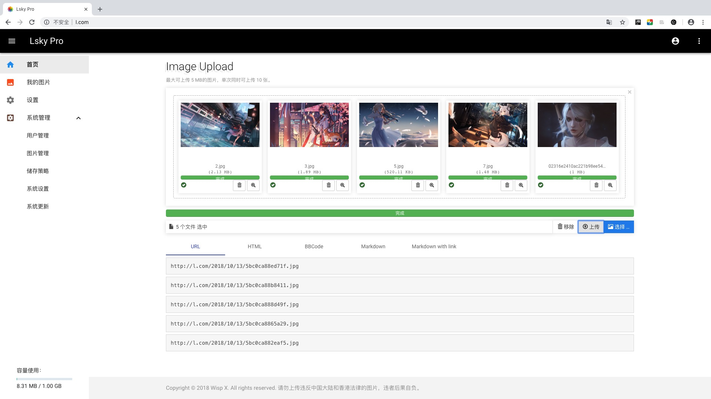
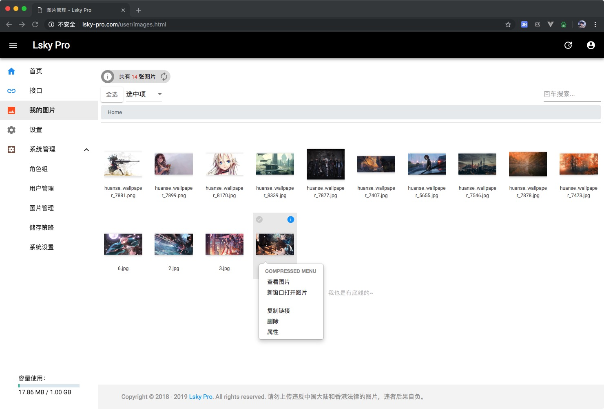

<p align="center">
    <a href="./public/static/app/images/logo.png" target="_blank">
        
    </a>
</p>

<p align="center">Lsky Pro - Your photo album on the cloud.</p>

[官网](https://www.lsky.pro) &nbsp;
[手册](https://www.kancloud.cn/wispx/lsky-pro) &nbsp;
[演示](https://pic.iqy.ink) &nbsp;
[Chrome 拓展](https://github.com/wisp-x/lsky-pro-chrome-extension)
[Telegram 群组](https://t.me/lsky_pro)

[](https://github.com/wisp-x/lsky-pro/blob/master/LICENSE)
[](http://php.net)
[](https://github.com/wisp-x/lsky-pro)

> 下载稳定版请点击[这里](https://github.com/wisp-x/lsky-pro/releases)，发现 bug 可发送邮件至邮箱：i@wispx.cn，或提交 [issues](https://github.com/wisp-x/lsky-pro/issues)  
> 下载速度慢的可以移步 Coding https://wispx.coding.net/p/lsky-pro-releases/d/lsky-pro-releases/git




### 📌 TODO
* [x] 支持第三方云储存，支持本地、阿里云 OSS、腾讯云 COS、七牛云、又拍云、FTP。
* [x] 支持多图上传、拖拽上传、粘贴上传、上传预览、全屏预览、页面响应式布局。
* [x] 简洁的图片管理功能，支持鼠标右键、单选多选、重命名等操作。
* [x] 强大的图片预览功能，支持响应式。
* [x] 支持全局配置用户初始剩余储存空间、支持单个设置用户剩余储存空间。
* [x] 支持一键复制图片外链、二维码扫描链接。
* [x] 支持设置上传文件、文件夹路径命名规则。
* [x] 支持在线平滑升级系统
* [x] 支持图片鉴黄功能。
* [x] 支持文件夹分类功能。
* [x] 对外开放的上传接口。

### 🛠 安装要求
* PHP 版本 &ge; 5.6(&le; 7.3)
* mysql 版本 &ge; 5.5
* mysqli 支持
* ZipArchive 支持
* fileinfo 拓展
* curl 拓展
* rewrite

注：如果使用 FTP 功能，需要开启 PHP 的 FTP 拓展

### 🔍 安装教程
1. 下载兰空，上传至 web 运行环境，解压。
2. 设置运行目录为 public。
3. 配置 Rewrite 规则：
    ##### Nginx：
    ```
    location / {
        if (!-e $request_filename) {
        	rewrite ^(.*)$ /index.php?s=$1 last; break;
        }
    }
    ```

    ##### Apache:
    Apache 直接使用 .htaccess 即可

4. 访问首页，未安装自动跳转至安装页面，根据页面提示安装即可。
5. 安装完成以后请设置 runtime 目录 0755 权限，如果你使用本地存储，public 目录也需要设置为0755权限

### 📧 联系我
- Email: i@wispx.cn

### 💰 捐赠
Lsky Pro 的开发和更新等，都是作者在空余时间独立开发，并免费开源使用，如果您认可我的作品，并且觉得对你有所帮助我愿意接受来自各方面的捐赠😃。    
<table width="100%">
    <tr>
        <th>支付宝</th>
        <th>微信</th>
    </tr>
    <tr>
        <td></td>
        <td></td>
    </tr>
</table>

### ♥ 鸣谢
- ThinkPHP
- Jquery
- BootStrap
- Mdui
- viewer.js
- context.js

### 📃 开源许可
[GPL 3.0](https://opensource.org/licenses/GPL-3.0)

Copyright (c) 2018-present Lsky Pro.
